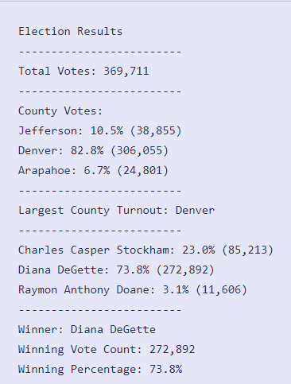
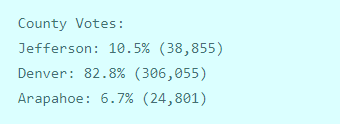
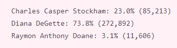
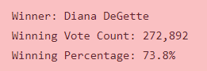
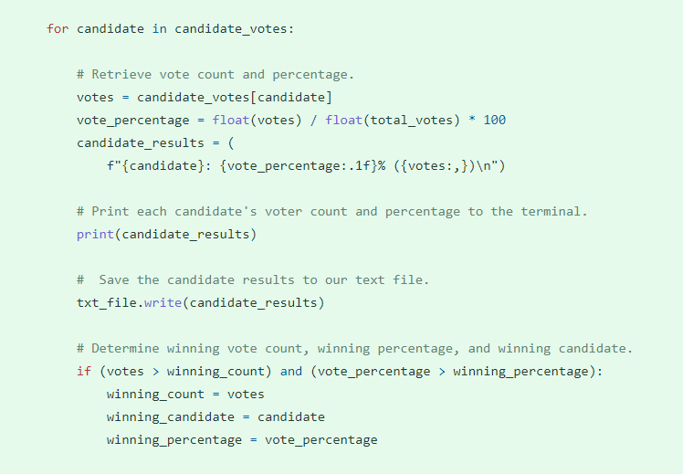

# Election_Analysis

## Overview of Election Audit:
**The purpose** of this election audit analysis is to help Seth and Tom to complete the election audit of a recent local congressional election by providing following additional tasks.

* The voter turnout for each county
* The percentage of votes from each county out of the total count
* The county with the highest turnout

## Election-Audit Results:
Attached below are the screenshots that indicate the Election Audit Results. 
As you can see from the image  369,711 total votes were cast in this congressional election.

To provide you a breakdown of the number of votes and percentage of total votes for each county in the precinct I attached below the screenshot. 
In a result Denver county had the largest number of votes (306,055 total votes, 82.8% ). The second largest number of votes in Jefferson county (38,855 total votes, 10,5%) 
So the last county was Arapahoe which has the smallest number of votes. 24,801 total votes, it is about 6.7%.
Largest County Turnout county was Denver.

  
According to this Election Analysis Candidate results Diana DeGette recieved the largest number of votes 73.8% (272,892). Charles Casper Stockham is the second person who got 85,213 number of votes, 23.0% of the total votes. So, the smallest number 11,606 of votes was recieved by Raymon Anthony Doane. It about 3.1$ of the total votes cast in the election. Above the following image you can see Candidate results.

Finally, The winner of the election was Diana DeGette, who received 272,892 number of votes, 73.8% of the total votes cast in the election.

## Election-Audit Summary:

The analysis of the election show that there were 369,711 votes cast in the election.

**The candidates were:**

*Charles Casper Stockham
*Diana DeGette
*Raymon Anthony Doane

**The candidate results were:**

*Charles Casper Stockham received 23.0% of the vote and 85,213 number of votes.

*Diana DeGette received 73.8% of the vote and 272,892 number of votes.

*Raymon Anthony Doane received 3.1% of the vote and 11,606 number of votes.

**The winner of the election was:**

**Diana DeGette**, who received **272,892** number of votes, **73.8%** of the total votes cast in the election.**

### To provide you a business proposal to the election commission on those scripts can be used with modifications for any Election. 
While reading the election results from each row inside the for loop, writing a script that gets the county name from each row.

